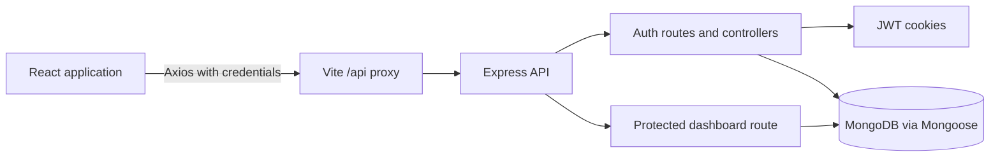

# Authentica

A MERN authentication system with cookie-based JWT sessions and a protected user dashboard.

## Overview

Authentica is a full-stack authentication project. It provides a React interface for registering, signing in, checking the current session, refreshing an expired access token, signing out, and viewing authenticated user and session details in a protected dashboard.

The backend is an Express API backed by MongoDB and Mongoose. The frontend is a Vite-powered React application that communicates with the API through Axios and keeps client-side authentication state in Redux Toolkit.

## Features

- User registration with name, email, and password validation
- Login with bcrypt password verification
- HttpOnly cookie-based authentication
- Short-lived access token and longer-lived refresh token
- Refresh-token rotation with the current token stored against the user record
- Session restoration on page reload through `/api/auth/me`
- Protected dashboard route and protected dashboard API endpoint
- Logout that clears cookies and removes the stored refresh token
- Client-side form validation and server-side request validation
- Centralized backend error responses
- Health-check endpoint at `/health`

The current implementation does not include roles, permissions, real-time updates, password reset, email verification, or a production deployment configuration.

## Tech Stack

### Frontend

- React 19
- React Router DOM 7
- Vite 6
- Tailwind CSS 4 with `@tailwindcss/vite`
- Axios

### Backend

- Node.js with ES modules
- Express 5
- Morgan request logging
- `cookie-parser`
- `express-validator`

### Database

- MongoDB
- Mongoose 9

### Authentication

- JSON Web Tokens with `jsonwebtoken`
- `bcrypt` password hashing
- HttpOnly `authToken` and `refreshToken` cookies

### State Management

- Redux Toolkit
- React Redux
- A custom `useAuth` hook that coordinates API calls and the `auth` slice

### Development Tools

- Nodemon for backend development
- ESLint for frontend linting
- Vite development server and production build tooling

## Architecture

The frontend uses the Vite proxy to send `/api` requests to the Express server during development. Express parses JSON and cookies, mounts the auth and dashboard routers, and connects to MongoDB through Mongoose. Authenticated routes verify the access-token cookie before loading the user.



On application startup, the frontend calls `/api/auth/me`. The `ProtectedRoute` waits for that check before either rendering the dashboard or redirecting to `/login`.

## Project Structure

```text
.
├── Backend/
│   ├── package.json
│   ├── server.js                    # Loads environment variables and starts the API
│   └── src/
│       ├── app.js                   # Express setup, middleware, routes, health check
│       ├── config/db.js             # MongoDB connection
│       ├── controllers/             # Auth and dashboard request handlers
│       ├── middlewares/             # Auth, validation, and error middleware
│       ├── models/user.model.js     # User schema and password methods
│       ├── routes/                  # Auth and dashboard route definitions
│       ├── utils/                   # Async handler and JWT generators
│       └── validators/              # Registration and login rules
├── Frontend/
│   ├── package.json
│   ├── vite.config.js               # React/Tailwind plugins and /api proxy
│   └── src/
│       ├── main.jsx                 # React, Redux, and router bootstrap
│       ├── app/                     # Router, store, shell, and global styles
│       └── features/auth/
│           ├── components/          # Forms, buttons, and protected-route guard
│           ├── hooks/useAuth.js     # Auth workflow and derived state
│           ├── pages/               # Landing, login, registration, dashboard
│           ├── service/auth.api.js  # Axios API client functions
│           └── states/auth.slice.js # Redux auth state and reducers
└── README.md
```

## Getting Started

### Prerequisites

- Node.js and npm
- A running MongoDB instance, local or hosted

### Repository setup

From the repository root, install dependencies in both applications:

```bash
cd Backend
npm install

cd ../Frontend
npm install
```

### Environment setup

Create `Backend/.env` with the variables described below. The backend `.gitignore` excludes this file, so keep real credentials there and do not commit them.

### Database setup

Set `MONGODB_URI` to a reachable MongoDB database. The checked-in local development value points to a database named `Auth_System` on the local MongoDB server; a MongoDB Atlas connection string can also be used.

### Run the application

Start the backend in one terminal:

```bash
cd Backend
npm run dev
```

The backend development script uses Nodemon and listens on the configured `PORT` (the existing local configuration uses `3000`). For a non-watch start, use `npm start`.

Start the frontend in a second terminal:

```bash
cd Frontend
npm run dev
```

Vite serves the frontend on port `5173` and proxies `/api` requests to `http://localhost:3000`. The application can then be opened at `http://localhost:5173`.

The frontend also provides these package scripts:

```bash
npm run build
npm run lint
npm run preview
```

## Environment Variables

Create these in `Backend/.env`:

```env
PORT=3000
MONGODB_URI=mongodb://localhost:27017/Auth_System
JWT_SECRET=replace-with-a-long-random-secret
NODE_ENV=development
```

| Variable | Required | Purpose |
| --- | --- | --- |
| `PORT` | Yes for the server listener | Port used by Express. |
| `MONGODB_URI` | Yes | MongoDB connection string. The app throws an error when it is missing. |
| `JWT_SECRET` | Yes for token signing and verification | Secret used for access and refresh JWTs. |
| `NODE_ENV` | Optional | When set to `production`, the auth cookies use the `Secure` flag. |

The frontend does not read a frontend-specific environment variable. Its Axios client uses `/api`, and the development proxy is defined in `Frontend/vite.config.js`.

## API Documentation

The API is mounted below `/api` unless otherwise noted.

### `GET /health`

Returns a server health response. No authentication is required.

```json
{
	"success": true,
	"message": "Server is healthy"
}
```

### `POST /api/auth/register`

Creates a user. No authentication is required.

Request body:

```json
{
	"name": "Ada Lovelace",
	"email": "ada@example.com",
	"password": "a-password-at-least-8-characters"
}
```

The backend requires a non-empty name, a valid email, and a password of at least eight characters. A duplicate email returns `409`; validation failures return `400` with an `errors` array.

Successful response: `201` with `success: true` and a registration message. Registration does not log the user in automatically.

### `POST /api/auth/login`

Authenticates a user. No authentication is required.

Request body:

```json
{
	"email": "ada@example.com",
	"password": "a-password-at-least-8-characters"
}
```

On success, the server sets the HttpOnly `authToken` and `refreshToken` cookies and returns the authenticated user's `id`, `name`, and `email`. Invalid credentials return `401`; malformed input returns `400`.

### `GET /api/auth/me`

Returns the current user. Requires a valid `authToken` cookie.

Successful response: `200` with the user's `id`, `name`, and `email`. Missing or invalid authentication returns `401`; a token referencing a missing user returns `404`.

### `POST /api/auth/refresh-token`

Issues a new access token and rotates the refresh token. It does not require the access token, but it does require a valid `refreshToken` cookie that matches the token stored for the user.

Successful response: `200` with a refresh message and replacement cookies. Missing, invalid, expired, or mismatched refresh tokens return `401`.

### `POST /api/auth/logout`

Logs out the current user. Requires a valid `authToken` cookie.

The server clears both cookies, removes the stored refresh token from the user document, and returns `200` on success.

### `GET /api/dashboard`

Returns the protected dashboard response. Requires a valid `authToken` cookie.

Successful response includes `success: true`, the message `Protected dashboard`, and the authenticated user object. Missing or invalid authentication returns an error response from the auth middleware.

## Authentication

1. Registration creates a MongoDB user document. The Mongoose `pre("save")` hook hashes a new or changed password with bcrypt.
2. Login compares the submitted password with the stored bcrypt hash.
3. A successful login creates an access JWT that expires in one hour and a refresh JWT that expires in seven days. Both are sent as HttpOnly cookies.
4. The access token contains the user ID and is verified by `authMiddleware` for protected routes.
5. The refresh endpoint verifies the refresh JWT and checks that it matches the refresh token stored on the user document before rotating both the stored value and the cookies.
6. The frontend checks `/api/auth/me` once on startup. `ProtectedRoute` redirects unauthenticated users to `/login` and preserves the attempted location in router state.
7. Logout clears the cookies and nulls the stored refresh token.

## Engineering Highlights

- **Separated responsibilities:** Express app setup, routes, controllers, middleware, validators, models, and token utilities are kept in separate modules.
- **Reusable async handling:** `asyncHandler` forwards rejected controller promises to the centralized error middleware.
- **Server-side validation:** `express-validator` rules are applied before registration and login controllers run.
- **Database-backed refresh tokens:** Refresh-token rotation is tied to the user document, allowing the server to reject a token that no longer matches the stored value.
- **Client auth boundary:** The Redux slice tracks loading, checked, succeeded, and failed states, while `useAuth` exposes the workflows used by pages and the route guard.
- **Development integration:** The frontend's `/api` proxy keeps browser requests same-origin during local development while the backend remains independently runnable.

## Error Handling and Validation

Backend validation failures return HTTP `400` with `{ success: false, errors: [...] }`. Controllers create errors with explicit status codes for duplicate users, invalid credentials, missing authentication, and invalid refresh tokens. The final Express error middleware logs the stack and returns a consistent `{ success: false, message }` shape.

The frontend performs basic required-field checks before submitting login and registration forms. Axios errors are normalized into JavaScript errors with the server message, status code, and response data so the auth hook can update Redux state and display a useful message.

## Security Considerations

Implemented protections include:

- Password hashing with bcrypt before persistence
- Password exclusion when the auth middleware loads a user for normal authenticated requests
- HttpOnly cookies to prevent client-side JavaScript from reading the tokens
- `SameSite=Strict` cookies
- `Secure` cookies when `NODE_ENV=production`
- Short access-token lifetime and refresh-token rotation
- Refresh-token matching against the database before issuing a new access token
- Validation of email format and minimum registration password length on the server

Before production use, the project should add protections not currently present, such as rate limiting, CSRF strategy appropriate to the deployment, stricter input normalization, security headers, and a review of the protected dashboard response so it cannot expose stored token data through the authenticated user object.

## Screenshots / Demo

No screenshots, video, live deployment URL, or demo asset is currently included in the repository.

## Future Improvements

- Add automated backend and frontend tests for registration, login, refresh, logout, validation, and protected-route behavior.
- Add rate limiting, security headers, and a deployment-specific CSRF strategy.
- Add password reset and email verification workflows.
- Add explicit frontend and backend production configuration, including a documented deployment process.
- Add role and permission support only if the product requires it; it is not implemented in the current user model.

## License

There is no root-level `LICENSE` file. The backend package metadata declares the ISC license in `Backend/package.json`.
